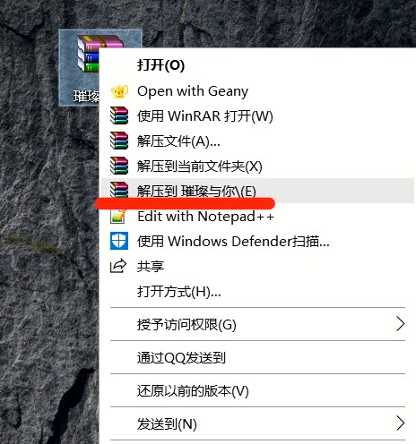
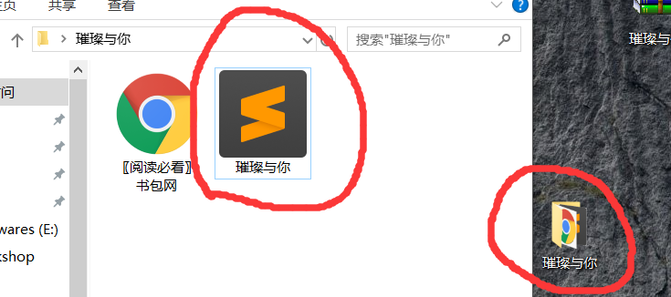
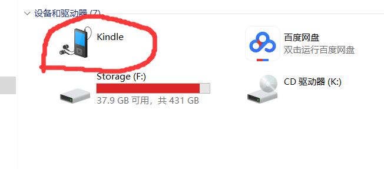
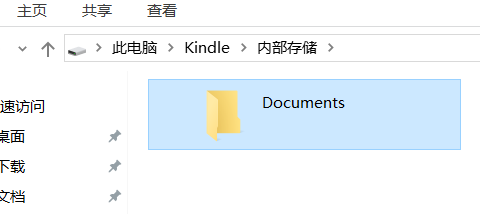

# Kindle下载导入电子书的步骤
## Kindle想要导入自己的电子书有两种方式
* 通过邮件发送到亚马逊服务器, 再由服务器发送到你的*Kindle*.
* 直接复制粘贴到硬盘中.

第一种方式较第二种麻烦, 所以这里详细介绍第二种方式的操作过程.  

1. 在小说下载网站下载小说, 这里以[书包网](https://www.bookbaow.com/)为例. 
2. 进入首页, 找到一篇小说, 拉到下面, 选择下载, **注意按照图中的相似位置点击下载**, 首选联通下载, 注意不要下载广告中的垃圾软件. 

    

3. 下载时**注意自己选择的保存位置**, 下载之后一般是一个rar压缩文件, 右键选择**解压到[某某小说名称]**.

    

4. 解压之后, 当前文件夹下会出现一个与压缩包同名的文件夹, 打开该文件夹, 选择```小说名称.txt```, 右键复制. 

    

5. 连接*Kindle*到电脑, 找到*Kindle*设备, 双击打开, 再进入**Documents**文件夹.

    
    
    

    右键粘贴, 之后拔下数据线, 打开*Kindle*即可看到已经导入的书籍.

6. 为保持电脑整洁, 建议定期清理电脑上下载的电子书. 
